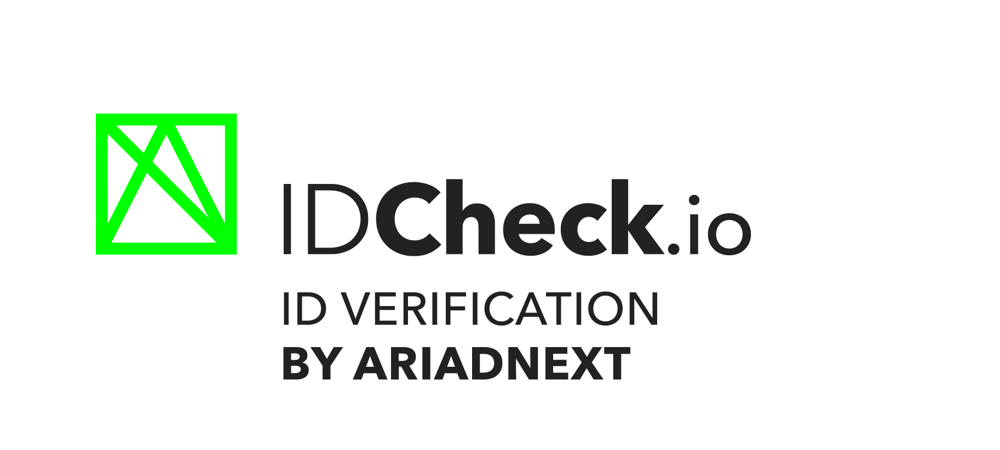

> 💡 For older IDCheck.io Mobile SDK Sample (v8.x.x), please checkout the [sdk_v8](https://github.com/ariadnext/IDCHECK.IO_SDK-example-Android/tree/sdk_v8) branch.<br>
> 💡 For older IDCheck.io Mobile SDK Sample (v7.x.x), please checkout the [sdk_v7](https://github.com/ariadnext/IDCHECK.IO_SDK-example-Android/tree/sdk_v7) branch.

# IDCheck.io Mobile SDK Sample for Android

[](https://developer.android.com/)
[](https://developer.android.com/tools/releases/platforms#6.0)

## Requirements

* **Deployment target:** Android 6 (API Level 23) or later.

## Getting Started

To start an IDCheck.io flow, you need to complete several steps.

### Step 1: Add dependency

To get this sample running, please follow the instructions :

First add our repository to your list of repository with the credentials that will be provided to you.

```groovy
repositories {
    maven {
        credentials {
            username 'YOUR_USERNAME'
            password 'YOUR_PASSWORD'
        }
        url "https://repoman.rennes.ariadnext.com/content/repositories/com.ariadnext.idcheckio/"
    }

    maven {
        url "https://raw.githubusercontent.com/idnow/idnow-android-sdk/main"
        content {
            includeGroupByRegex("io\\.idnow.*")
        }
    }
}
```

Then add the Gradle dependency in your build.gradle file:

```groovy
dependencies { 
    implementation 'com.ariadnext.android.idcheckio:sdk:latest_version' {
        transitive = true
    }
}
```

### Step 2: Preload
> The preload method is no longer mandatory now that phones are becoming increasingly powerful.

To ensure a proper startup of the SDK, it is recommended to launch the preload method as early as possible before starting a session.

```(kotlin)
Idcheckio.preload(context: Context, extractData: Boolean = true)
```

### Step 3: Activate the SDK
To activate the SDK, you'll need an authentication token, it will be provided to you by the **Customer Success Management (CSM)** team. Use this token to initialize the SDK in your application.
To do so, you need to call the activate as soon as you enter your onboarding (to avoid having to wait for it to finish).

You can personalize the appearance of the SDK user interface by passing a custom font during activation. This is done by using the optional font parameter in the activate(withToken:extractData:font:) method.

```(kotlin)
val headingFont = ResourcesCompat.getFont(context, R.font.YOUR_HEADING_FONT)
val regularFont = ResourcesCompat.getFont(context, R.font.YOUR_REGULAR_FONT)
val mediumFullFont = ResourcesCompat.getFont(context, R.font.YOUR_MEDIUM_FONT)
val customFont: CustomFont? = CustomFont(headingFont, regularFont, mediumFullFont)
Idcheckio.activate('YOUR_ACTIVATION_TOKEN', appContext, callbackInterface, customFont)
```

### Step 4: Start a session
#### Use Onboarding Mode (Recommended)
Onboarding mode will simplify the integration of the sdk by handling all the configuration on the server side. With onboarding mode, there's no need to manually start multiple online sessions to capture several documents unlike the online mode (for example, ID session followed by bioliveness session). Once the server-side configuration is complete, simply start the onboarding environment, and all your sessions will launch automatically, one after the other.

CSM team will assist you in setting up this journey according to your specific needs.

When onboarding is started, all customization is retrieved from the server and automatically applied without any action required on the mobile side. 

The CSM team will create the theme in your company's style with you. 

To start an onboarding you just need to call the startOnboarding method on the Idcheckio object.

```(kotlin)
Idcheckio.startOnboarding(context: Context, folderUid: String, resultCallback: OnboardingResultCallback)
```

#### Use Online Mode (Alternative)

It’s not recommended to use this mode except if you are already using it or if you have special needs that can not be achieved with the dynamic onboarding. Before using this integration mode speak about your issues with your CSM.

As the sdk do the capture one by one and didn't have information on the previous captures, we created an `OnlineContext` object which is used by the sdk to store data and conserve them between capture. To make it works on your flow, for the first capture you can call start a session without providing an onlineContext. And for all the following capture you just need to pass the onlineContext that the sdk gave you in the last result.

Before starting your session, you have to first create the IDCheck.io sdk view. The SDK View is a custom android component named `IdcheckioView` that extends the Android Fragment class. To use it, you have to instantiate it programmatically and add it to your view. The simplest way of doing it is to create an empty fragment to handle the logic and add the `IdcheckioView` as a child using the `childFragmentManager`.

To configure a capture session, you have to set capture parameters to the IdcheckioView object.
First, you have to instantiate and build the IdcheckioView component directly using the provided IdcheckioView.Builder() object.
Use the provided builder to setup session parameters programmatically and return the component to be inflated like a classic Fragment.
Most of the parameters are optional, the only mandatory parameter needed to start a session is the document type.

```(kotlin)
// Setup component
val idcheckioView = IdcheckioView.Builder()
  .docType(DocumentType.ID) // Pass the DocumentType to the SDK
  .orientation(Orientation.PORTRAIT) // Portrait orientation is recommended (except for tablet)
  .listener(this) // Register IdcheckioInteractionInterface listener
  .build()

// We add the fragment to our view using the child fragment manager and we start it.
idcheckioView.let {
  childFragmentManager.beginTransaction().replace(R.id.child_container,it).commit()
  it.startOnline()
}
```

To start a session, you just need to call the startOnline() on the `IdcheckioView` created from the builder.
```(kotlin)
idcheckioView.startOnline(onlineContext: OnlineContext? = null)
```

The `OnlineContext` is an object, deeply linked to online mode of the SDK, used to communicate with the CIS API in order to send some context with the scanned document. This object cannot been instantiated, it is returned by the SDK on previous online captures in the `IdcheckioResult` object. It makes scanning multiple documents easier by keeping track of the CIS online context and reference document in case of Biometric Liveness session. All the parameters are optional and `null` by default. As mentioned, its three first attributes are used to specify the folder unique identifier, the reference document and associated check task identifiers :
- `folderUid`: the CIS folder UID on which document have been uploaded
- `taskUid`: the CIS analyze task UID of the document that has been uploaded
- `documentUid`: the CIS document UID of the document that has been uploaded
- `referenceTaskUid`: the eventual CIS reference analyze task UID (provided only if isReferenceDocument has been set to true on OnlineConfig param),
- `referenceDocUid`: the eventual CIS reference document UID (provided only if isReferenceDocument has been set to true on OnlineConfig param),
- `livenessStatus`: tells if the CIS folder contains a valid identity document permitting to start a liveness session. (provided only if isReferenceDocument has been set to true on OnlineConfig param)

> In order to launch a biometric liveness session, you first need to provide a valid identity document (containing a face which will be used as reference for the facematch algorithm). This document will serve as the reference document for the facematching of the liveness session. Don’t forget to set `isReferenceDoc` to `true` on OnlineConfig param.

IDCheck.io Mobile SDK provides you multiple parameters to custom its behavior and configure your session properly.

##### SDK Parameters
| Field | Type | Description | Default value |
| --- | ---  | --- | --- |
| documentType | DocumentType | Specify which document type the SDK should find | DISABLED |
| integrityCheck | IntegrityCheck | Determines whether the SDK should check document integrity. Two parameters possible : <br>- readEmrtd : Will read the NFC chip if present.<br>- docLiveness : Will take a live video if the document moving to analyse security features. | Both false. |
| orientation | Orientation | Set interface orientation PORTRAIT, LANDSCAPE or AUTOMATIC | Automatic |
| onlineConfig | OnlineConfig | Set CIS specific configuration | See OnlineConfig documentation |
| captureMode | CaptureMode | Give the possibility to choose between the upload and the capture of a document | CAMERA |

##### DocumentType
| Type | Description |
| --- | ---  |
| DISABLED | No document detection specified. This means that SDK will try to detect any document type. |
| ID | ID document detection. |
| VEHICLE_REGISTRATION | Vehicle registration detection. |
| A4 | Detection of any A4 document type. |
| FRENCH_HEALTH_CARD | French Health Card (Both 1997 and 2007 models). |
| BANK_CHECK | Bank check document detection. |
| OLD_DL_FR | Old french driving license document detection. |
| SELFIE | Selfie for face recognition. |
| LIVENESS | Liveness session. |
| PHOTO | Take a photo of any document. The SDK will try to detect any document type. |

##### OnlineConfig
| Field | Type | Description | values | Default value |
| --- | ---  | --- | --- | --- |
| isReferenceDocument| Boolean| Specifies if the document will be a reference for a biometric liveness. | true / false | false |
| cisType | CISType | Associated CIS DocumentType to upload. Please always provide a value for this property if the associated document comes from a A4 scanning session. NOTE: The OTHER CISType will add your image as an attachment in the cis folder and it won’t be analyzed. | ID, IBAN, CHEQUE, TAX_SHEET, PAY_SLIP, ADDRESS_PROOF, CREDIT_CARD, PORTRAIT, LEGAL_ENTITY, CAR_REGISTRATION, LIVENESS, OTHER | null |
| folderUid | String | If you have already created a folder in the CIS apart of the SDK, please provide its UID here. Else let this value at null, the SDK will create a folder by itself and return its UID in OnlineContext object. | | null | 
| biometricConsent | Boolean | Allows you to force the biometric consent in case you already asked it to the user (consent regarding automatic processing of his biometric data). If you didn’t already asked the final user his consent (i.e if biometricConsent is null), the SDK will display a popup before starting a liveness or selfie capture. | true / false / null | null |
| enableManualAnalysis | Boolean | The document will be automatically be sent to Manual Analysis where a human operator will check it manually and give a verdict. | true / false | false  |
|cisDocCheckLaunch | Boolean | Allow you to disable the document analysis at the end of the capture is you need it, or if you want to call it by yourself later. | true / false | true  |

##### CaptureMode
| Type | Description |
| --- | ---  |
| CAMERA | Use the camera to capture the document. |
| PROMPT | Show a page to let the user choose between uploading his document or capturing it. |
| UPLOAD | Ask the user to upload his document. |

##### SDK Extra Parameters
| Field | Type | Description | Default value |
| --- | ---  | --- | --- |
| language | Enum | Optional - Force the SDK language. More details in the specific Language section. | null |
| adjustCrop | Boolean | Allow end-user to adjust the detected document crop. | false |
| manualButtonTimer | Integer | Timeout after which the manual photo button appears. To disable the manual button display, set this value to -1 | 10 |

##### Language
| Type | Description |
| --- | ---  |
| sq | Albanian |
| ar | Arabic |
| ca | Catalan |
| cs | Czech |
| nl | Dutch |
| en | English |
| fr | French |
| de | German |
| el | Greek |
| hu | Hungarian |
| it | Italian |
| pl | Polish |
| pt | Portuguese |
| ro | Romanian |
| ru | Russian |
| sr | Serbian |
| sk | Slovak |
| es | Spanish |
| uk | Ukrainian |

##### Callbacks
To interact with the SDK, receive capture result or handle errors, you have to provide an object implementing the interface IdcheckioInteractionInterface to the component. You can setup the listener using the builder setter as shown on the above exemple.

You can then check in the callback which kind of IdcheckioInteraction has been triggered to update the view or handle result or errors.

| IdcheckioInteraction | Resulting class | Description |
| --- | ---  | --- |
| RESULT | IdcheckioResult | Contains the captured result. See IdcheckioResult. |
| ERROR | ErrorMsg | Contains the error message (you can iterate on the subcause to add some business logic and restart a capture if needed. See IdcheckioError). |
| UPDATE_CAMERA_LIST | AvailableCamerasMsg | Contains a Camera list that will be used by the SDK for the capture. You can update the isEnabled flag of each camera to true/false to filter some of them. |

Here’s how to handle the interaction :
```(kotlin)
override fun onIdcheckioInteraction(interaction: IdcheckioInteraction,data: Any?) {
    when (interaction) {
        // Here we get the resulting data and images from the SDK
        IdcheckioInteraction.RESULT -> (data as IdcheckioResult).let {
            // continue your flow
        }
        // Here we are notified in case of an error to inform the final user
        IdcheckioInteraction.ERROR -> (data as ErrorMsg).let {
            // navigate to your error page
        }
        // Here we give you the list of all the cameras found by the sdk.
        IdcheckioInteraction.UPDATE_CAMERA_LIST -> (data as AvailableCamerasMsg).let {
            // update the camera list (or not) to your needs
        }
    }
}
```

#### Handling errors
For the error case, you will receive a ErrorMsg object.

```(kotlin)
data class ErrorMsg (val cause: IdcheckioErrorCause, val details:String, val message:String?, val subCause: IdcheckioSubCause? = null)
```
The object is structured as follow:
- The first parameter, `cause`, is an enumeration listing the main category, or cause of the error.
- The second parameter, `details`, is a detailed error message for more details (like CIS error message) on the error to help you debug on what happened.
- The third parameter, `message`, is an optional error message that can be displayed to the final user.
- The last parameter, `subCause`, is an optional enumeration listing a subset of specific error causes that you can use to inform the user about what went wrong, restart the capture or trigger a new capture from within your application.

> The error details is for debug purpose only and should not be displayed as it is to the end user (this message is not translated by the way).

You should first check the subCause, it’s a custom enumeration that’s we created to have a filter of the error you can handle at runtime. 
If the subCause is empty then you can look at the main cause which is quite generic.
If you receive one of those subCause, it means that we already did the maximum capture retries and the user still failed to complete the capture.
```(kotlin)
enum class IdcheckioSubCause {
    /** Missing permissions, permissions have been refused by user */
    MISSING_PERMISSIONS,
    /** Onboarding session have been cancelled by user */
    CANCELLED_BY_USER,
    /** This model of document cannot be used as it was rejected by configuration. */
    MODEL_REJECTED,
    /** The document is expired. */
    ANALYSIS_EXPIRED_DOC,
    /** The document is not eligible for a PVID session. */
    PVID_NOT_ELIGIBLE,
    /** We failed to identified the document */
    UNIDENTIFIED,
    /** The document does not contain a face and can't be used for face recognition */
    DOC_NOT_USABLE_FACEREC,
    /** The document uploaded is not supported. */
    UNSUPPORTED_FILE_EXTENSION
}
```

If you want to handle generic errors, you can use the main error cause :
```(kotlin)
enum class IdcheckioErrorCause {
    /** 
     * Regroup all the integration errors. If you need to understand what you are doing wrong, please contact the CSM team with the details. 
     * Should only happen during integration. 
     */
    CUSTOMER_ERROR,
    /** Regroup all the network errors that happens when the SDK fails to reach our server. */
    NETWORK_ERROR,
    /** The user has done something wrong during the capture. */
    USER_ERROR,
    /** Internal server error from our side. */
    INTERNAL_ERROR,
    /** Regroup all the hardware/software problems that could happen during the session. Nothing we/you can do. */
    DEVICE_ERROR,
    /** The document shown by the user is not acceptable. (Expired, rejected, ...) */
    DOCUMENT_ERROR
}
```

### Step 5: Get the result
A session will be "stopped" by two ways:
- The session ended by itself.
- The user aborted the session by pressing the "back" button.

In both cases, you’ll be notified. If the user aborted the session via the back button, you’ll get the specific `.cancelledByUser`.

> Do not call `stop()` by yourself, unless you have a specific need (for example, overriding the back button command).

When the SDK matches with a document, results are sent back as an `IdcheckioResult` object. This object is using the IdcheckioInteraction.RESULT interaction of the dedicated callback IdcheckioInteractionInterface.
It contains :
- `onlineContext` : Informations related to the document, need to be passed to the next capture. You can also retrieve the informations related to the created document on the CIS here such as documentUid and folderUid.
- `sessionInfos` : a list of ErrorMsg (non fatal errors) that occurred during the session. It is mainly used with the emrtd reading to tell why the emrtd session have not been done (for example if there if there is no chip on the document)
- `images` : list of all the images taken during the capture.

## Sample application

This sample project aims to showcase all possibilities of the **IDCheck.io Mobile SDK** and the associated best practices regarding these features. It also helps you understand how you can easily integrate the SDK, activate it and customise/adapt it to your application and business needs.

The main screen displays two distinct capture flows :

 - **Online flow** : This flow uses the SDK for capturing any type of document based on the parameter given to the sdk.
 - **Onboarding session** : Specific capture session that will handle a complete onboarding.